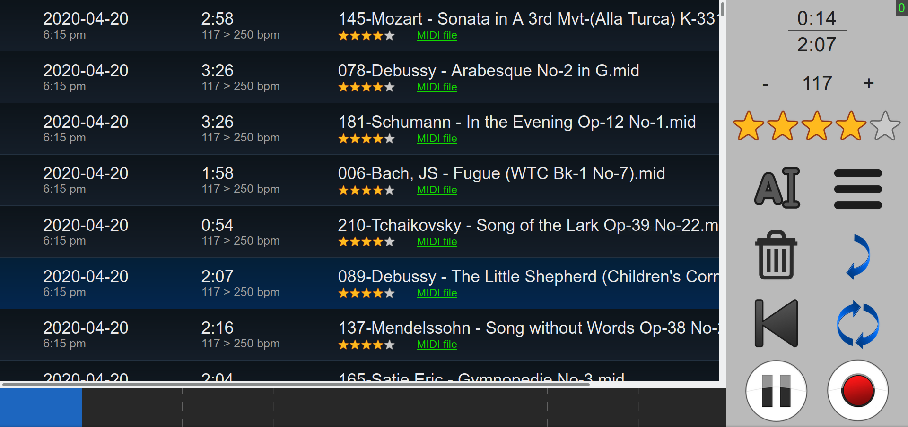

# RPi-Diskalvier-network-player
(inspired by Florian Bador)
This player allows for a Raspberry Pi to host a Midi player/recorder server. This plays using the serial MIDI port used for various instruments and DOES NOT CONTAIN A SYNTHYSIZER! It was designed to update a player piano from Yamaha that still took floppy disks for playback. You can route it to a local synth like timidity if you need support for a synth.
It has a web interface and ajax/json support for future Alexa and Google home integration.

Very much a WIP
The aplaymidi file is compiled for x86-64 linux, to use this on an arm device you must re-compile the aplay binaries for the architecture of your desire. It is a custom version which adds setting BPM and starting a song a specified number of seconds in.

To run the program start the flasktest.py file and open a web browser to http://127.0.0.1:5000 or http://localhost:5000

Currently the player works for selecting songs, playing them, scraping the tempo and other information from midi files, playing back a midi file from a given time (seek, not supported by standard libraries and deceivingly difficult to implement due to tempo changes and timings)
, downloading the songs, and changing the tempo.

Need to fix:
keys stuck down when pausing (sometimes), recording functionality, proper button updates on the web interface, better process management (sometimes a process gets stuck due to the API), tons of little bugs.

Need to add: Database support (to reduce memory overhead and launch time), Playlist support, input/output device selection, auto launch on startup, Google Assistant support (using IFTTT), instrument changer, secure connection (SSL), automated setup (GUI for config file).
